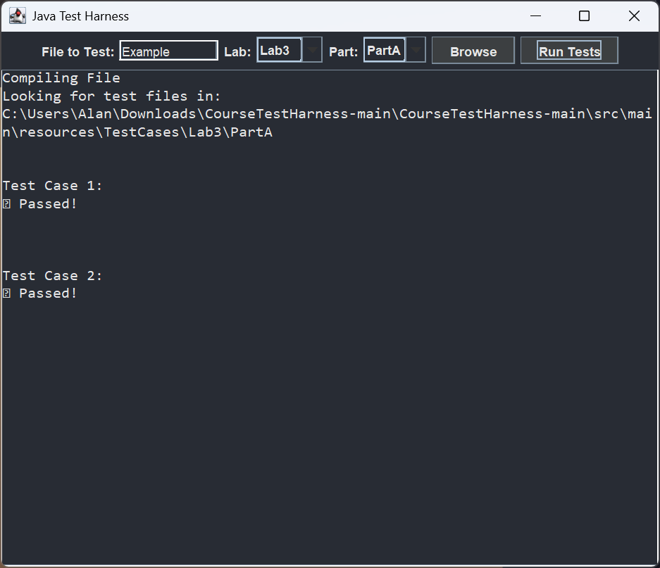
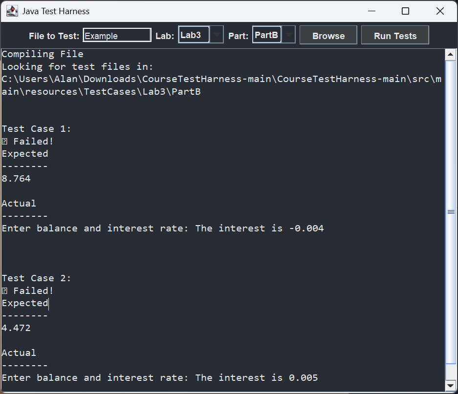

# Java Test Harness GUI

A comprehensive GUI tool for assisted testing of Java programming assignments with test case management and result visualization.

## 🎯 Purpose

This test harness provides users with an automated way to validate their Java assignments against predefined test cases, offering immediate feedback.

---

## Examples ## 
Shown below are some snippets of a program being tested. On the left is a valid test. The right image depicts a failed test. 
<p align="center">
   
   &nbsp;&nbsp;&nbsp;
   
</p>


## 📋 Prerequisites

### Required Software
| Software | Version | Download Link |
|----------|---------|---------------|
| **Java JDK** | 11 or higher | [Oracle JDK Downloads](https://www.oracle.com/java/technologies/downloads/#jdk24-windows) |
| **IntelliJ IDEA** | Community/Ultimate | [JetBrains Download](https://www.jetbrains.com/idea/download/?section=windows) |

---

## 🚀 Installation & Setup

### Step 1: Install Prerequisites
1. **Download and install Java JDK 11+**
   - Follow the installer instructions

2. **Install IntelliJ IDEA**
   - Download appropriate version for your OS
   - Run installer with default settings

### Step 2: Import Project
1. **Open IntelliJ IDEA**
2. **Select "Open"** from the welcome screen
3. **Navigate to project folder** and select `pom.xml` file inside `CourseTestHarness_1/`
4. **Wait for Maven import** to complete (IntelliJ will download dependencies)

### Step 3: Verify Installation
1. Navigate to `src/main/java/`
2. Locate and run `TestHarnessGUI.java`
3. Confirm the GUI opens without errors

---

## 📖 Usage Guide

### Creating Your Solution Files
1. **Create new packages** under `src/main/java/`. An example is given below:
   ```
   src/main/java/
   ├── Lab1/
   │   ├── YourSolution.java
   │   └── AnotherProblem.java
   └── Lab2/
       └── NextAssignment.java
   ```

2. **Follow consistent naming conventions**, as depicted above

### Running Tests
1. **Launch the Test Harness**
   - Run `TestHarnessGUI.java` from your IDE
   - The GUI window will appear

2. **Select Your Solution**
   - Click "Browse" or use the file selector
   - Navigate to your Java file (e.g., `Lab1/YourSolution.java`)

3. **Choose the Test Configuration**
   - Select appropriate Lab/Part from dropdown (e.g., `Lab1.PartA`)
   - Ensure the selection matches your solution file

4. **Execute Tests**
   - Click **"Run Tests"** button
   - View results in the output panel

### Understanding Results
- **✅ PASS**: Test case completed successfully
- **❌ FAIL**: Test case failed - check error message
- **⚠️ ERROR**: Compilation or runtime error occurred

---

## 📂 Project Structure

```
CourseTestHarness_1/
├── pom.xml                          # Maven project configuration
├── src/
│   ├── main/
│   │   ├── java/
│   │   │   ├── TestHarnessGUI.java  # Main GUI application
│   │   │   ├── TestHarness.java     # Core testing logic
│   │   │   └── [Your Solutions]/    # Create your packages here
│   │   └── resources/
│   │       ├── MyWork/              # Reference solutions (if provided)
│   │       └── test-cases/          # Automated test cases
│   └── test/                        # Unit tests for harness itself
└── target/                          # Compiled output (auto-generated)
```

### Key Components
- **TestHarnessGUI.java**: User interface for test execution
- **TestHarness.java**: Backend testing engine
- **test-cases/**: .txt files with pre-written test parameters and outputs
- **MyWork/**: Reference implementations for comparison

---

## 🐛 Best Practices

### Code Organization
- Use consistent package and class names
- Follow Java naming conventions (CamelCase)
- Include proper access modifiers (public, private)
- Add [javadoc](https://docs.oracle.com/en/java/javase/25/javadoc/javadoc-tool.html#GUID-7A344353-3BBF-45C4-8B28-15025DDCC643) comments for methods 

### Testing Strategy
- Test edge cases (empty inputs, boundary values)
- Verify error handling for invalid inputs  
- Compare output format exactly as specified

---

## ⚠️ Important Notes

- **Academic Integrity**: Use this tool for learning and validation, not as a substitute for understanding the material
- **Time Management**: Don't rely solely on automated tests. Understand the intended outputs.

---

## 📝 License & Usage

This test harness is provided for educational purposes. Redistribution or commercial use requires permission from the course administrator.
